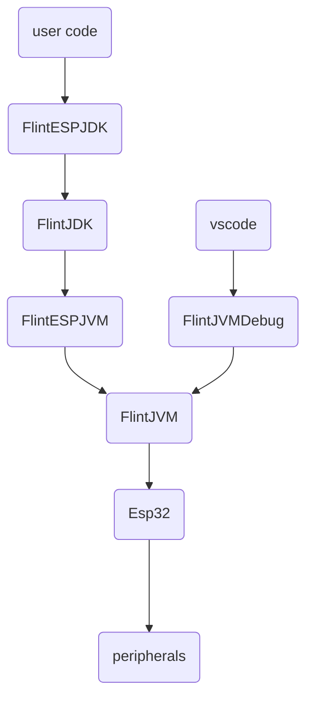

# FlintESPJDK

Provides a Java library that runs on FlintESPJVM to access ESP32 peripherals。

zero means for starter and easy to use

```mermaid
graph TD
A(user code) --> B(FlintESPJDK)
B --> C(FlintJDK)
C --> D(FlintESPJVM)
D --> E(FlintJVM)
E --> F(Esp32)
G(vscode) --> H(FlintJVMDebug)
H --> E
F ---> I(peripherals)
```
